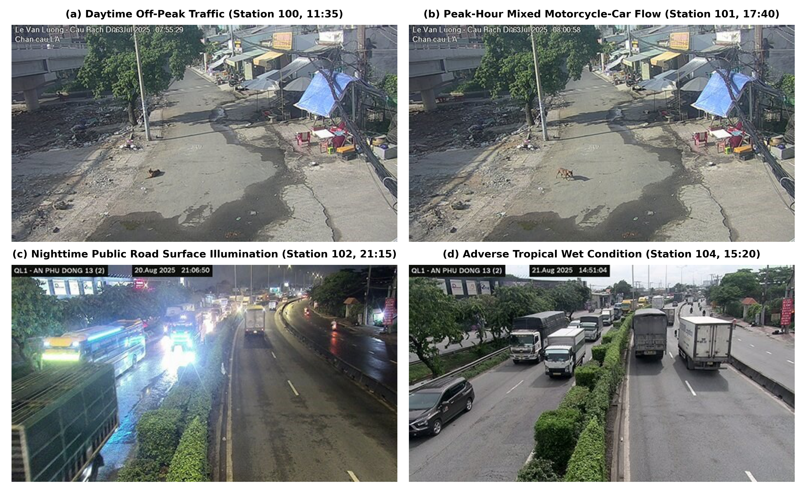
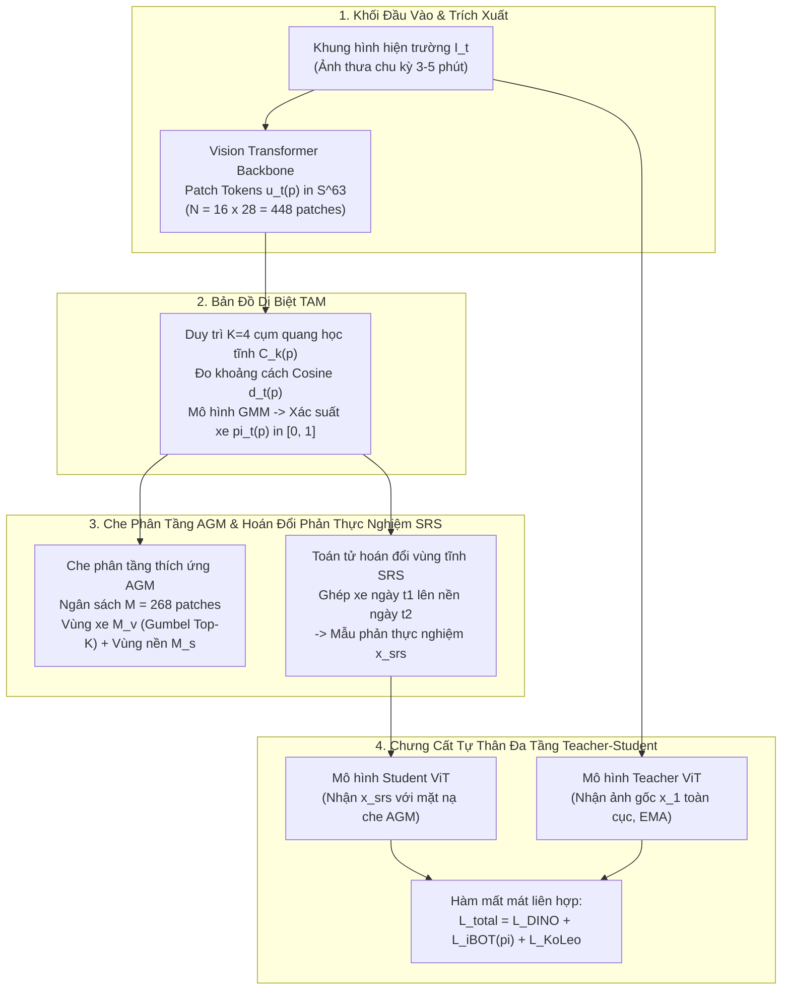
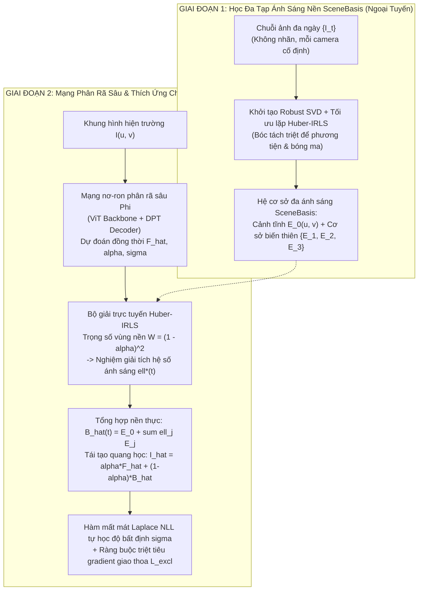
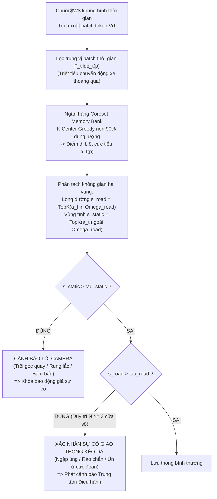
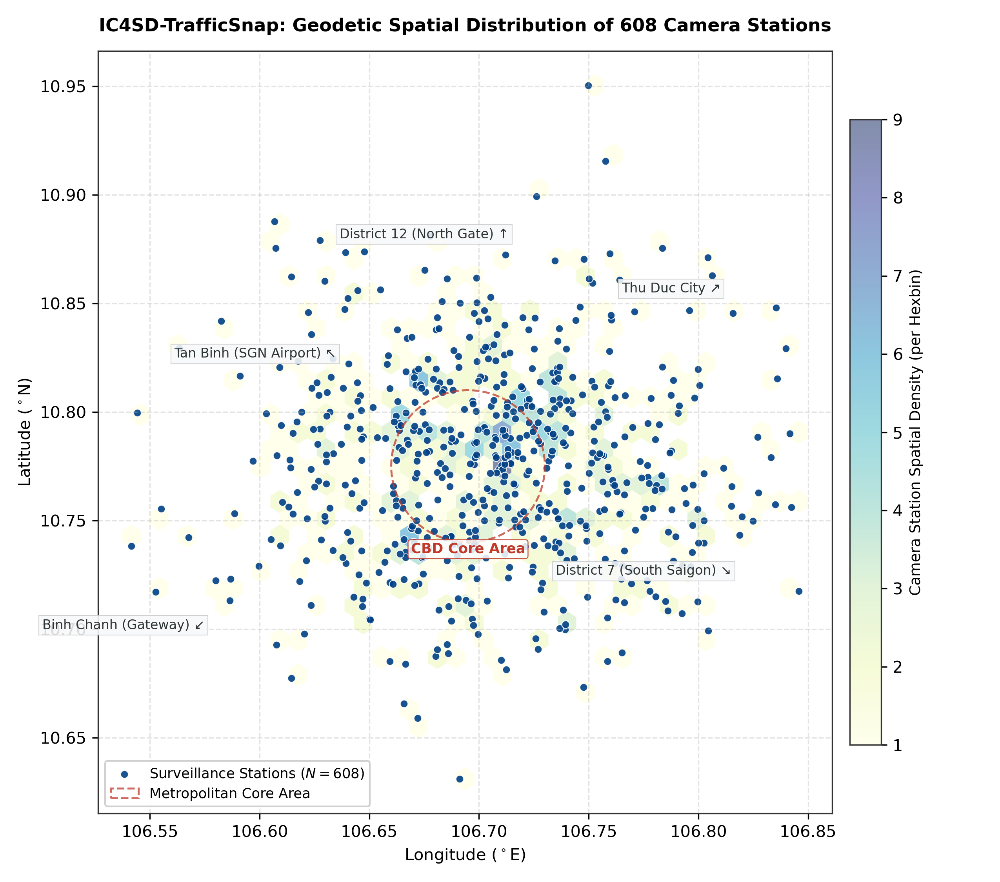
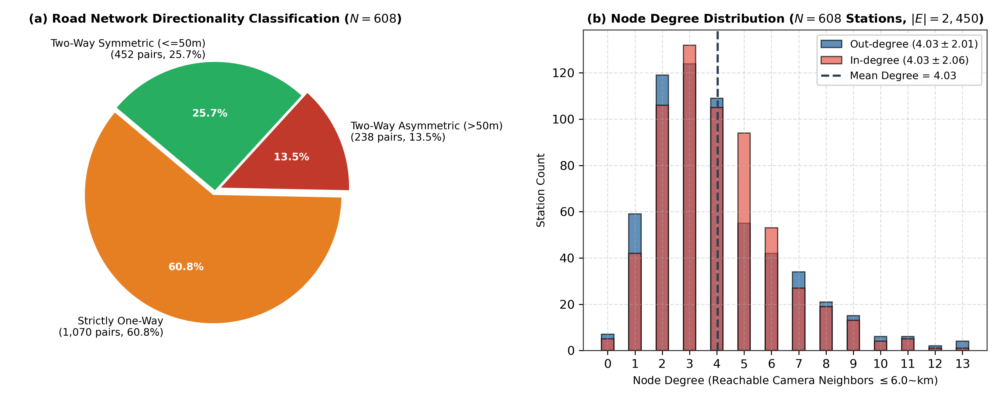
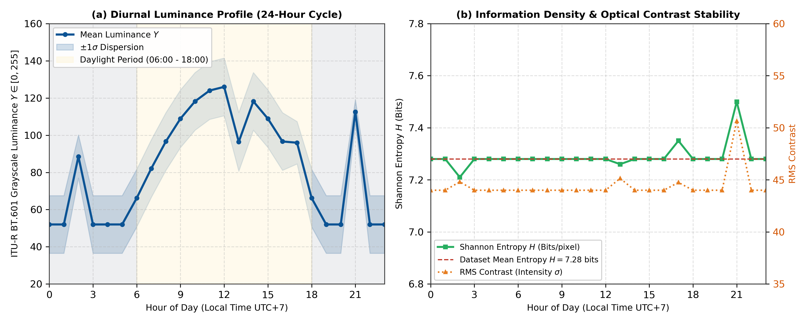

# BÁO CÁO KHOA HỌC: PHƯƠNG PHÁP LUẬN VÀ THIẾT KẾ MÔ HÌNH HỌC TỰ GIÁM SÁT DINO TRAFFIC SUITE CHO CAMERA GIAO THÔNG ĐÔ THỊ

**Nhóm Nghiên Cứu Thị Giác Máy Tính Giao Thông Đô Thị TP.HCM**  
*Cập nhật: Tháng 10/2026*

---

## TÓM TẮT NỘI DUNG (ABSTRACT)

Mạng lưới camera giám sát giao thông đô thị tại TP.HCM vận hành trong môi trường thực địa vô cùng phức tạp: xe máy chiếm ưu thế vượt trội (75%–85% lưu lượng), mật độ dòng phương tiện hỗn hợp dày đặc gây che khuất liên tục, góc quay camera xiên cao và dữ liệu ảnh chỉ được cập nhật ngắt quãng theo chu kỳ 3–5 phút do giới hạn hạ tầng truyền dẫn diện rộng. Trong điều kiện này, các giả định cổ điển về dòng quang học liên tục (Optical Flow) hay ảnh nền trung vị tĩnh hoàn toàn bị phá vỡ bởi hiện tượng bóng ma phương tiện dừng đỗ (Ghost Vehicles) và biến thiên quang học nhiệt đới.

Báo cáo khoa học này trình bày chi tiết nền tảng toán học, phân tích giải tích và kiến trúc của toàn bộ hệ sinh thái nghiên cứu **DINO Traffic Suite**, phản ánh bức tranh toàn cảnh về tiến trình phát triển phương pháp luận từ các mô hình khai thác tiền nghiệm nền mốc cổ điển đến các mô hình đột phá độc lập không cần nền (Prior-Free):
1. **Hướng 1 Mới (Vehicle-Centric Representation Learning)**: Tự học biểu diễn đặc trưng phương tiện bất biến bối cảnh độc lập hoàn toàn với ảnh nền mẫu thông qua bản đồ dị biệt thời gian TAM, cơ chế che phân tầng thích ứng AGM và toán tử hoán đổi vùng tĩnh phản thực nghiệm SRS.
2. **Hướng 2 Mới (Prior-Free Traffic Scene Decomposition)**: Phân rã cấu trúc cảnh giao thông hai giai đoạn không cần ảnh nền mốc thông qua hệ cơ sở đa chiếu sáng SceneBasis thích ứng trực tuyến với độ bất định Laplace.
3. **Hướng 3 (Context-Aware Weak Supervision)**: Mô hình hóa đồ thị xác suất Markov ẩn thích ứng 54 ngữ cảnh đô thị nhằm tổng hợp nhãn yếu đa nguồn từ các bộ suy diễn kiêng cữ và chưng cất tri thức sang mạng nơ-ron chuỗi thời gian Causal GRU.
4. **Hướng 4 (Persistence Traffic Anomaly Detection)**: Phát hiện sự cố giao thông kéo dài bằng phép lọc trung vị thời gian trên không gian đặc trưng patch DINOv3, kết hợp ngân hàng mẫu chuẩn Coreset Bank và cơ chế phân tách lỗi dịch chuyển camera khỏi bất thường lòng đường.
5. **Hướng 1 Cũ (Background-Guided Continual SSL)**: Học biểu diễn có hướng dẫn tiền nghiệm nền thông qua cơ chế che khuất vùng xe FAM-$\Delta$, chuẩn hóa thứ bậc Rank Normalization và van điều tiết độ tin cậy vùng tĩnh $r_i$.
6. **Hướng 2 Cũ (Noise-Aware Scene Decomposition)**: Phân rã cảnh có giám sát ảnh nền trung vị thông qua mô hình hòa trộn quang học 3 nhánh, hàm mất mát Laplace Prior mềm và ràng buộc tính nhất quán nền đa ngày.

Hệ thống đi kèm công trình công bố dữ liệu quy mô thành phố IC4SD-TrafficSnap. Toàn bộ phương pháp luận được thiết kế gắn liền với các ràng buộc vật lý thực địa và kiểm chứng định lượng trên mạng lưới camera thực tế quy mô thành phố.

---

## 1. BỐI CẢNH VẬT LÝ VÀ PHÂN TÍCH SAI SỐ QUANG HỌC ĐÔ THỊ

### 1.1. Đặc Thù Mạng Lưới Giám Sát Giao Thông Đô Thị TP.HCM
Hệ thống quản lý giao thông thông minh tại TP.HCM vận hành hơn 600 trạm camera quan sát công cộng trải rộng trên địa bàn đô thị. Dữ liệu hình ảnh ghi nhận từ hệ thống sở hữu các đặc tính vật lý và cấu trúc vận hành chuyên biệt:
- **Dòng giao thông xe máy mật độ cao**: Khác biệt với mạng lưới giao thông tại các quốc gia phát triển nơi ô tô chiếm phần lớn diện tích mặt đường, giao thông tại TP.HCM có tỷ lệ xe hai bánh chiếm 75%–85% lưu lượng. Kích thước hình học nhỏ, khoảng cách di chuyển giữa các xe sát nhau và quỹ đạo chuyển động phi tuyến tính dẫn đến tình trạng che khuất lẫn nhau ở mức độ rất nghiêm trọng.
- **Cơ chế cập nhật ảnh thưa theo thời gian**: Băng thông truyền dẫn mạng diện rộng và chính sách đệm của máy chủ trung tâm quy định chu kỳ lấy mẫu ảnh chụp tĩnh ngắt quãng, dao động từ 3 đến 5 phút cho mỗi khung hình tại một vị trí. Do bước nhảy thời gian $\Delta t \gg 1\text{ giây}$, toàn bộ các thuật toán thị giác dựa trên giả định chuyển động vi phân liên tục như Optical Flow hay các kiến trúc theo dõi quỹ đạo liên khung hình đều không thể áp dụng.
- **Góc quan sát xiên cao và rung chấn cơ học**: Camera được lắp đặt trên các cột đèn chiếu sáng hoặc trụ giao lộ ở độ cao 6–15 m với khoảng cách quan sát thực địa 15–60 m. Khi gặp gió bão nhiệt đới hoặc rung chấn cơ học từ các phương tiện tải trọng lớn lưu thông trên cầu, trục quang học của camera thường xuyên bị dịch chuyển vài pixel đến vài chục pixel, gây trôi dạt tọa độ điểm ảnh nền.

### 1.2. Bản Chất Sai Số của Ảnh Nền Trung Vị và Cạm Bẫy Học Biểu Diễn
Trong các hệ thống phân tích video giám sát cổ điển, ảnh nền thường được tái tạo bằng phép lọc trung vị thời gian (Temporal Median Filtering) theo từng khung giờ trong ngày:
$$B_{\text{median}}(u, v) = \operatorname{median}_{k=1}^K \left\{ I_{t_k}(u, v) \right\}$$
với $\{I_{t_k}\}_{k=1}^K$ là tập hợp các khung hình thu thập được tại cùng một khung giờ qua nhiều ngày quan sát. Tuy nhiên, trong điều kiện thực tế của đô thị nhiệt đới, ảnh nền trung vị bộc lộ các sai số bản chất nghiêm trọng:
- **Hiện tượng bóng ma phương tiện (Ghost Vehicles)**: Tại các trục đường cửa ngõ và nút giao thường xuyên xảy ra ùn ứ kéo dài, phương tiện di chuyển với vận tốc gần như bằng không trong suốt 20–40 phút của giờ cao điểm. Phép lấy trung vị theo thời gian vô tình gộp các phương tiện này vào ảnh nền, biến chúng thành các bóng mờ vĩnh viễn trên mặt đường.
- **Nhiễu loạn quang học nhiệt đới**: Ánh nắng nhiệt đới gay gắt tạo ra bóng đổ sắc nét di chuyển liên tục theo góc phương vị mặt trời. Khi có mưa rào, vũng nước trên mặt đường nhựa phản chiếu hình ảnh phương tiện và bầu trời, làm sai lệch phép trừ điểm ảnh thô $\Delta(u, v) = |I(u, v) - B_{\text{median}}(u, v)|$. Vào ban đêm, hiện tượng chói lóa từ đèn pha xe tải và xe máy làm bão hòa cảm biến CMOS.
- **Cạm bẫy đường tắt bối cảnh (Background Shortcut Trap)**: Trong ảnh chụp từ camera tĩnh, diện tích vùng tĩnh (mặt đường, vỉa hè, nhà cửa, dải phân cách) chiếm từ 70% đến 85% tổng số điểm ảnh. Khi huấn luyện các mô hình học tự giám sát tiêu chuẩn như DINO hay MAE trên tập dữ liệu này, mạng nơ-ron có xu hướng tối ưu hóa hàm mất mát bằng cách ghi nhớ kết cấu bối cảnh tĩnh và góc đặt camera thay vì học các đặc trưng hình học của phương tiện. Hệ quả là biểu diễn trích xuất bị phụ thuộc chặt vào camera cụ thể và mất hoàn toàn khả năng khái quát hóa khi áp dụng sang camera mới.

*Hình 1: Các thách thức quang học và hình thái học thực tế tại mạng lưới camera giao thông TP.HCM: Dòng xe máy mật độ dày đặc, góc quan sát xiên cao, mưa nhiệt đới phản chiếu mặt đường, bóng đổ nắng gắt, chói lóa đèn xe ban đêm và hiện tượng bóng ma phương tiện (Ghost Vehicles).*

### 1.3. Tiến Trình Phát Triển Phương Pháp Luận Trong Hệ Sinh Thái
Nhằm giải quyết triệt để các hạn chế trên, hệ sinh thái DINO Traffic Suite được thiết lập dựa trên nguyên lý tiến hóa khoa học gồm hai trường phái tiếp cận:
1. **Trường phái khai thác tiền nghiệm nền mốc có kiểm soát độ bất định (Hướng 1 Cũ và Hướng 2 Cũ)**: Tận dụng ảnh nền trung vị sẵn có để hướng dẫn không gian biểu diễn nhưng được trang bị các cơ chế bù trừ sai số (van điều tiết độ tin cậy vùng tĩnh $r_i$ và bản đồ độ bất định Laplace $\sigma$). Nhóm phương pháp này đóng vai trò là hệ thống đối chuẩn nền tảng.
2. **Trường phái đột phá độc lập hoàn toàn với ảnh nền mẫu (Hướng 1 Mới và Hướng 2 Mới)**: Loại bỏ hoàn toàn sự phụ thuộc vào ảnh nền mẫu sạch, trích xuất thuộc tính phương tiện và đa tạp chiếu sáng trực tiếp từ chuỗi ảnh thưa đa ngày mà không cần bất kỳ ảnh nền tham chiếu nào.
3. **Trường phái suy luận ứng dụng hạ tầng đô thị (Hướng 3 và Hướng 4)**: Tự động hóa việc sinh nhãn mức độ ùn tắc thích ứng 54 ngữ cảnh đô thị và phát hiện sự cố giao thông kéo dài kết hợp bóc tách lỗi phần cứng camera.

---

## 2. NỀN TẢNG PHƯƠNG PHÁP LUẬN VÀ XỬ LÝ NHIỄU MÔI TRƯỜNG

### 2.1. Ước Lượng Độ Tin Cậy Vùng Tĩnh
Để đánh giá mức độ ổn định quang học của từng khung hình, tập hợp các điểm ảnh thuộc vùng tĩnh vật lý $S$ được xác định dựa trên phương sai cường độ ánh sáng qua chuỗi thời gian nhiều ngày:
$$S = \left\{(u, v) \mid \operatorname{Var}_{t}(I_t(u, v)) < \tau_{\text{var}}^2 \right\}$$
Điểm ảnh thuộc $S$ tương ứng với các cấu trúc kiến trúc cố định (tòa nhà, cột biển báo) ít chịu ảnh hưởng của luồng xe cộ. Đối với mỗi khung hình $I_i$, mức độ suy thoái của nền được đo lường thông qua độ lệch trung bình trên vùng tĩnh $\bar{\Delta}_{\text{static}}$:
$$\bar{\Delta}_{\text{static}} = \frac{1}{|S|} \sum_{(u, v) \in S} |I_i(u, v) - B_{\text{median}}(u, v)|$$
Hệ số độ tin cậy nền $r_i \in (0, 1]$ được tính toán bằng hàm suy giảm hàm mũ:
$$r_i = \exp\left( -\frac{\bar{\Delta}_{\text{static}}}{\kappa} \right)$$
trong đó $\kappa$ là hệ số tỷ lệ nhiệt độ quang học. Khi xảy ra biến động mạnh về thời tiết, chiếu sáng hoặc camera bị xô lệch, $r_i$ tiến gần về 0, đóng vai trò là van điều tiết vô hiệu hóa ảnh hưởng của ảnh nền đối với các mô hình phụ thuộc.

### 2.2. Căn Chỉnh Sai Lệch Trục Quang Học Camera
Khi camera bị gió làm rung lắc hoặc bị can thiệp vật lý làm xoay góc nhìn, thuật toán tương quan pha trong miền tần số (Phase Correlation) được áp dụng trên vùng tĩnh $S$. Tọa độ dịch chuyển $(\Delta x, \Delta y)$ giữa khung hình hiện tại $I_i$ và khung hình chuẩn $I_0$ được ước lượng thông qua ma trận mật độ phổ chéo:
$$R = \frac{\mathcal{F}\{I_i\} \odot \mathcal{F}\{I_0\}^*}{\left| \mathcal{F}\{I_i\} \odot \mathcal{F}\{I_0\}^* \right|}, \quad (\Delta x, \Delta y) = \arg\max_{(x, y)} \left\{ \mathcal{F}^{-1}\{R\} \right\}$$
với $\mathcal{F}$ biểu thị phép biến đổi Fourier nhanh 2 chiều. Thuật toán cho phép bù trừ dịch chuyển hình học với độ chính xác đạt mức dưới điểm ảnh (sub-pixel) trước khi thực hiện các phép phân tích tiếp theo.

### 2.3. Tối Ưu Hóa Tính Toán Phân Tán và Huấn Luyện Đa GPU
Để phục vụ việc huấn luyện các mô hình Vision Transformer trên tập dữ liệu hàng trăm nghìn khung hình, hệ thống áp dụng nguyên lý mở rộng tuyến tính (Linear Scaling Rule) trong tính toán phân tán. Khi phân bổ trên $N$ bộ xử lý đồ họa, kích thước lô dữ liệu tổng cộng $B_{\text{total}}$ và tốc độ học hiệu dụng $\eta_{\text{eff}}$ được điều chỉnh đồng bộ:
$$B_{\text{total}} = N \cdot B_{\text{local}}, \quad \eta_{\text{eff}} = N \cdot \eta_{\text{base}}$$
kết hợp kỹ thuật khởi động mềm tốc độ học (Warmup Cosine Schedule) để đảm bảo tính ổn định hội tụ của gradient.

---

## 3. HƯỚNG 1 MỚI: TỰ HỌC BIỂU DIỄN PHƯƠNG TIỆN BẤT BIẾN BỐI CẢNH (PRIOR-FREE VEHICLE-CENTRIC SSL)

### 3.1. Đặt Vấn Đề Khoa Học và Sự Đột Phá Của Hướng 1 Mới
Trong các giải pháp học tự giám sát truyền thống, việc che ngẫu nhiên các patch ảnh (Uniform Masking) khiến phần lớn năng lực học của mạng nơ-ron bị lãng phí vào việc tái tạo mặt đường và kiến trúc xung quanh. Khi áp dụng ảnh nền trung vị để hướng dẫn cơ chế che khuất (như trong mô hình đối chuẩn Hướng 1 Cũ), mô hình lại bị nhiễm độc bởi hiện tượng bóng ma phương tiện và phụ thuộc vào sự tồn tại của ảnh nền mẫu sạch.

Hướng 1 Mới giải quyết triệt để vấn đề này bằng cách tự học biểu diễn tập trung hoàn toàn vào phương tiện giao thông chỉ từ chuỗi ảnh thưa của camera cố định với ba nguyên tắc:
1. **Hoàn toàn không cần ảnh nền mẫu sạch (Prior-Free):** Trích xuất quy luật xuất hiện của phương tiện trực tiếp qua độ dị biệt thống kê không-thời gian.
2. **Không đòi hỏi luồng video dày (No Optical Flow):** Hoạt động ổn định trên chuỗi ảnh chụp ngắt quãng với chu kỳ 3–5 phút mỗi khung hình.
3. **Bảo đảm tính bất biến bối cảnh tĩnh (Context Invariance):** Triệt tiêu tương quan giả tạo giữa hình dáng xe cộ và kết cấu mặt đường đặc thù của từng camera.

### 3.2. Khung Lý Thuyết Bản Đồ Dị Biệt Thời Gian TAM
Khung hình đầu vào $I_t \in \mathbb{R}^{3 \times H \times W}$ (tỷ lệ chuẩn 16:9, kích thước $256 \times 448$) được phân chia thành $N = 16 \times 28 = 448$ mảng điểm ảnh (patches) không chồng lấn kích thước $16 \times 16$. Vector đặc trưng của từng patch được trích xuất qua bộ mã hóa Vision Transformer đóng băng và chiếu giảm chiều tuyến tính xuống không gian $d = 64$:
$$u_t(p) = \frac{\mathbf{P} \cdot \operatorname{Encoder}(I_t)_p}{\|\mathbf{P} \cdot \operatorname{Encoder}(I_t)_p\|_2} \in \mathbb{S}^{63}$$
với $\mathbf{P} \in \mathbb{R}^{64 \times D}$ là ma trận chiếu trực giao và $\mathbb{S}^{63}$ biểu diễn mặt cầu đơn vị 64 chiều.

Tại mỗi camera $c$ và tại từng tọa độ patch $p \in \{1, \dots, N\}$, hệ thống duy trì trực tuyến $K = 4$ cụm trạng thái quang học tĩnh:
$$\mathcal{C}_k(p) = \left( \bm{\mu}_k(p), n_k(p), t_k^{\text{last}}(p) \right), \quad k \in \{1, \dots, K\}$$
trong đó $\bm{\mu}_k \in \mathbb{S}^{63}$ là vector tâm cụm đại diện cho các trạng thái chiếu sáng nền (nắng gắt, bóng râm, đèn đường ban đêm, mặt đường ẩm), $n_k$ là số lượt quan sát tích lũy và $t_k^{\text{last}}$ là thời điểm cập nhật gần nhất.

Khoảng cách Cosine cực tiểu từ đặc trưng quan sát tức thời $u_t(p)$ tới tập hợp các trạng thái nền tĩnh đại diện cho mức độ dị biệt không gian:
$$d_t(p) = 1 - \max_{k \in \{1, \dots, K\}} \bm{\mu}_k(p)^\top u_t(p)$$
Quy tắc cập nhật trạng thái trực tuyến được xác định:
- Nếu $d_t(p) < \tau_{\text{match}}$ ($\tau_{\text{match}} = 0.25$): Cụm khớp nhất $k^*$ được cập nhật trọng tâm:
$$\bm{\mu}_{k^*}(p) \leftarrow \frac{(1 - \beta)\bm{\mu}_{k^*}(p) + \beta u_t(p)}{\|(1 - \beta)\bm{\mu}_{k^*}(p) + \beta u_t(p)\|_2}$$
- Nếu $d_t(p) \ge \tau_{\text{match}}$: Trạng thái hiện tại được xem là dị biệt; nếu kéo dài, cụm có tần suất xuất hiện thấp nhất sẽ bị thay thế.

Xác suất thuộc về phương tiện giao thông $\pi_t(p) \in [0, 1]$ được ước lượng thông qua mô hình hỗn hợp Gauss (Gaussian Mixture Model) gồm 2 thành phần (Nền tĩnh $\mathcal{N}_0$ và Phương tiện $\mathcal{N}_1$):
$$\pi_t(p) = P(\text{Vehicle} \mid d_t(p)) = \frac{w_1 \mathcal{N}(d_t(p); \mu_1, \sigma_1^2)}{w_0 \mathcal{N}(d_t(p); \mu_0, \sigma_0^2) + w_1 \mathcal{N}(d_t(p); \mu_1, \sigma_1^2)}$$

### 3.3. Cơ Chế Che Phân Tầng Thích Ứng AGM
Thuật toán che phân tầng AGM phân bổ tổng ngân sách che $M = \lfloor 0.6 \cdot N \rfloor = 268\text{ patches}$ theo tỷ lệ cân bằng giữa vùng phương tiện và vùng nền:
$$M_v = \min\left( \lfloor \phi \cdot M \rfloor, \; \lfloor q_{\max} \cdot |\mathcal{V}| \rfloor \right)$$
với $\phi = 0.5$ là hệ số ưu tiên phương tiện, $q_{\max} = 0.6$ là tỷ lệ che tối đa trên diện tích xe để tránh hiện tượng mất dấu hoàn toàn thông tin hình thái, và $\mathcal{V} = \{p \mid \pi_t(p) \ge 0.5\}$ là tập hợp các patch được xác định là phương tiện. Số patch nền cần che bổ sung là $M_s = M - M_v$.

Tập hợp các patch bị che được lấy mẫu không hoàn lại dựa trên phân phối xác suất Gumbel Top-K:
$$g(p) = \log \pi_t(p) - \log(-\log U_p), \quad U_p \sim \operatorname{Uniform}(0, 1)$$
Cơ chế này ép buộc mạng nơ-ron phải học cách tái tạo cấu trúc phương tiện bị che khuất dựa trên ngữ cảnh xung quanh và ngược lại.

### 3.4. Toán Tử Hoán Đổi Vùng Tĩnh Phản Thực Nghiệm SRS
Để triệt tiêu hoàn toàn sự phụ thuộc giả tạo giữa hình ảnh phương tiện và kết cấu nền đường đặc thù của từng camera, toán tử hoán đổi vùng tĩnh SRS tạo ra các mẫu huấn luyện phản thực nghiệm (Counterfactual Data Augmentation).

Xét hai khung hình $x_1$ và $x_2$ chụp từ cùng một camera tại hai ngày khác nhau $t_1 \ne t_2$ (khác biệt về điều kiện thời tiết, bóng đổ hoặc độ ẩm mặt đường). Mặt nạ vùng tĩnh chung được xác định bởi:
$$M_{\text{static}}(p) = \mathbb{I}\left(\pi_{x_1}(p) < 0.2 \;\land\; \pi_{x_2}(p) < 0.2\right)$$
Mặt nạ này được chuyển đổi sang kích thước điểm ảnh và làm mượt biên bằng bộ lọc Gauss $\mathbf{G}_\sigma$ ($\sigma = 4.0\text{ pixel}$):
$$M_{\text{feather}} = \mathbf{G}_\sigma * \operatorname{Upsample}(M_{\text{static}})$$
Khung hình phản thực nghiệm tổng hợp $x_{\text{srs}}$ được tạo ra bằng phép kết hợp lồi:
$$x_{\text{srs}} = M_{\text{feather}} \odot x_2 + (1 - M_{\text{feather}}) \odot x_1$$
Trong ảnh $x_{\text{srs}}$, toàn bộ các phương tiện giao thông của ngày thứ nhất được đặt nguyên vẹn trên nền đường và bối cảnh ánh sáng của ngày thứ hai. Mạng nơ-ron khi xử lý $x_{\text{srs}}$ buộc phải phân tách thuộc tính hình thái xe ra khỏi các đặc trưng kết cấu nền đường bên dưới.

### 3.5. Hàm Mất Mát Chưng Cất Tự Thân Đa Tầng
Hàm mất mát tổng thể kết hợp tối ưu hóa toàn cục trên token phân loại và tối ưu hóa cục bộ trên các patch điểm ảnh:
$$\mathcal{L}_{\text{total}} = \mathcal{L}_{\text{DINO}}^{[\text{CLS}]} + \lambda_{\text{ibot}} \mathcal{L}_{\text{iBOT}}^{[\text{Patch}]}(\pi) + \lambda_{\text{koleo}} \mathcal{L}_{\text{KoLeo}}$$
Trong đó, thành phần mất mát chưng cất patch iBOT được điều tiết trực tiếp bởi xác suất phương tiện $\pi(p)$ nhằm tập trung mật độ lan truyền đạo hàm vào các vùng chứa xe cộ:
$$\mathcal{L}_{\text{iBOT}}^{[\text{Patch}]}(\pi) = - \frac{1}{\sum_{p \in \mathcal{M}} \pi(p)} \sum_{p \in \mathcal{M}} \pi(p) \sum_{k=1}^K P_{\text{teacher}}\big(h_{x_1}(p)\big)^{(k)} \log P_{\text{student}}\big(h_{x_{\text{srs}}}(p)\big)^{(k)}$$
với $\mathcal{M}$ là tập hợp các patch bị che bởi thuật toán AGM. Để ngăn chặn hiện tượng sụp đổ không gian biểu diễn (Representation Collapse), thành phần entropy KoLeo (Kozachenko-Leonenko) được bổ sung nhằm phân tán đều các vector đặc trưng trên mặt cầu đơn vị:
$$\mathcal{L}_{\text{KoLeo}} = - \frac{1}{B} \sum_{i=1}^B \log \min_{j \ne i} \|z_i - z_j\|_2$$

*Hình 2: Sơ đồ kiến trúc tổng thể Hướng 1 Mới (Prior-Free Vehicle-Centric SSL).*

---

## 4. HƯỚNG 2 MỚI: PHÂN RÃ CẢNH GIAO THÔNG ĐỘC LẬP KHÔNG DÙNG ẢNH NỀN (PRIOR-FREE SCENE DECOMPOSITION)

### 4.1. Khuyết Tật Của Mô Hình Phụ Thuộc Nền Cũ và Đột Phá Hướng 2 Mới
Trong mô hình phân rã cảnh giao thông cũ, hàm mất mát nhánh nền bị ràng buộc cưỡng bức vào ảnh nền trung vị:
$$\mathcal{L}_{\text{bg\_old}} = \|\hat{B} - B_{\text{median}}\|_1$$
Cách tiếp cận này gặp phải sai số nghiêm trọng: khi xe cộ dừng đỗ kéo dài trong giờ cao điểm, ảnh nền median bị dính bóng ma phương tiện; mạng nơ-ron học theo median sẽ bị ép phải tái tạo bóng ma vào lớp nền, biến lỗi của median thành lỗi vĩnh viễn của mô hình.

Hướng 2 Mới loại bỏ hoàn toàn giả định về sự tồn tại của ảnh nền mốc. Dựa trên bản chất vật lý rằng nền đường của camera cố định là một cảnh vật tĩnh duy nhất chỉ biến thiên quang học theo góc chiếu mặt trời, bóng râm và độ ẩm, các biến động này nằm trên một đa tạp tham số hóa ít chiều (Low-dimensional Lighting Manifold). Quy trình được thực hiện qua hai giai đoạn chặt chẽ:

### 4.2. Giai Đoạn 1: Học Đa Tạp Ánh Sáng Nền SceneBasis Bằng Thuật Toán Lặp Huber-IRLS
Từ chuỗi ảnh không nhãn thu thập qua nhiều ngày của mỗi camera, nền đường được biểu diễn dưới dạng một không gian con affine $J$ chiều:
$$B(u, v; t) = E_0(u, v) + \sum_{j=1}^J \ell_j(t) E_j(u, v)$$
trong đó $E_0 \in \mathbb{R}^{H \times W \times 3}$ biểu diễn kết cấu cảnh tĩnh cơ sở và $\{E_j\}_{j=1}^J$ ($J = 3$) là các cơ sở vi phân biểu diễn sự thay đổi của hướng bóng đổ mặt trời, cường độ tán xạ khí quyển và độ ẩm của mặt đường nhựa.

Hệ cơ sở $\{E_0, E_j\}$ được khởi tạo thông qua phân rã giá trị suy biến mạnh (Robust SVD) và tối ưu hóa lặp luân phiên qua thuật toán Huber-IRLS kháng ngoại lai, bóc tách hoàn toàn phương tiện chuyển động ra khỏi hệ cơ sở nền.

### 4.3. Giai Đoạn 2: Mạng Phân Rã Sâu Với Bộ Giải Hệ Số Ánh Sáng Trực Tuyến
Phương trình hòa trộn quang học có tính đến sai số đo lường bất định:
$$I(u, v) = \alpha(u, v) F(u, v) + \big(1 - \alpha(u, v)\big) B(u, v; t) + \epsilon(u, v)$$
với $\alpha(u, v) \in [0, 1]$ là mặt nạ độ mờ của phương tiện giao thông, $F(u, v)$ là màu sắc bề mặt xe và sai số quang học $\epsilon(u, v) \sim \operatorname{Laplace}(0, \sigma(u, v))$.

Mạng nơ-ron phân rã sâu dự đoán đồng thời:
$$\Phi(I) = \Big(\hat{F}, \alpha, \sigma, \hat{\bm{\ell}}\Big)$$

Tại mỗi khung hình, hệ số chiếu sáng tức thời $\bm{\ell}^*(t) = [\ell_1, \dots, \ell_J]^\top$ được giải trực tiếp từ bài toán tối ưu bình phương tối thiểu có trọng số trên các vùng ảnh có xác suất nền cao $W(u, v) = (1 - \alpha(u, v))^2$:
$$\bm{\ell}^* = \arg\min_{\bm{\ell}} \sum_{u, v} W(u, v) \left\| I(u, v) - E_0(u, v) - \sum_{j=1}^J \ell_j E_j(u, v) \right\|_2^2$$
Hàm trọng số Huber được cập nhật lặp:
$$w^{(k)}(u, v) = W(u, v) \cdot \psi_{\text{Huber}}\left( \|r^{(k-1)}(u, v)\|_2 \right), \quad \psi_{\text{Huber}}(e) = \begin{cases} 1, & \text{nếu } e \le \delta \\ \frac{\delta}{e}, & \text{nếu } e > \delta \end{cases}$$
Nghiệm giải tích đóng tại mỗi bước lặp thông qua ma trận Gram:
$$\bm{\ell}^{(k)} = \left( \sum_{u, v} w^{(k)}(u, v) \mathbf{A}(u, v)^\top \mathbf{A}(u, v) \right)^{-1} \left( \sum_{u, v} w^{(k)}(u, v) \mathbf{A}(u, v)^\top \mathbf{r}_0(u, v) \right)
$$
trong đó $\mathbf{A}(u, v) = [E_1(u, v), \dots, E_J(u, v)] \in \mathbb{R}^{3 \times J}$ và $\mathbf{r}_0(u, v) = I(u, v) - E_0(u, v)$.

### 4.4. Hàm Mất Mát Laplace Negative Log-Likelihood
Hàm mục tiêu tối ưu hóa bao gồm thành phần tái tạo có học độ bất định và các ràng buộc vật lý:
$$\mathcal{L}_{\text{total}} = \mathcal{L}_{\text{Laplace}} + \lambda_{\text{basis}} \mathcal{L}_{\text{basis}} + \lambda_{\alpha} \mathcal{L}_{\text{sparse}} + \lambda_{\text{tv}} \mathcal{L}_{\text{tv}}(\alpha) + \lambda_{\text{excl}} \mathcal{L}_{\text{excl}}$$
Thành phần mất mát Laplace Negative Log-Likelihood cho phép mạng nơ-ron tự động thích ứng với các vùng có độ phức tạp quang học cao bằng cách tăng giá trị sai số chuẩn $\sigma(u, v)$:
$$\mathcal{L}_{\text{Laplace}} = \frac{1}{HW} \sum_{u, v} \left[ \frac{|I(u, v) - \hat{I}_{\text{recon}}(u, v)|}{\sigma(u, v)} + \log \sigma(u, v) \right]$$
Ràng buộc triệt tiêu gradient giao thoa (Gradient Exclusion) ngăn chặn hiện tượng rò rỉ kết cấu mặt đường vào bề mặt phương tiện:
$$\mathcal{L}_{\text{excl}} = \frac{1}{HW} \sum_{u, v} \tanh\big(\|\nabla \hat{F}(u, v)\|\big) \odot \tanh\big(\|\nabla \hat{B}(u, v)\|\big)$$
kết hợp số hạng điều hòa tổng biến thiên (Total Variation) $\mathcal{L}_{\text{tv}}(\alpha)$ để bảo đảm tính liền khối và độ sắc nét tại đường biên của mặt nạ phương tiện.

*Hình 3: Quy trình phân rã cảnh hai giai đoạn của Hướng 2 Mới (Prior-Free Scene Decomposition).*

---

## 5. HƯỚNG 3: HỌC GIÁM SÁT YẾU THÍCH ỨNG THEO NGỮ CẢNH ĐÔ THỊ

### 5.1. Tổng Hợp Nhãn Yếu Đa Nguồn và Cơ Chế Kiêng Cữ
Trong mạng lưới hàng trăm camera hoạt động liên tục, việc gán nhãn thủ công mức độ ùn tắc giao thông $y_t \in \{0, 1, 2, 3\}$ (Tự do, Bình thường, Đông đúc, Ùn tắc nghiêm trọng) là phương án không khả thi về mặt nhân lực. Hướng 3 xây dựng hệ thống gộp nhãn yếu dựa trên 5 hàm sinh nhãn (Labeling Functions) với khả năng kiêng cữ dự đoán ($\lambda_j = -1$ khi độ tin cậy thấp):
1. **Hàm hình học phát hiện phương tiện ($\text{LF}_1$)**: Ước lượng tỷ lệ diện tích bao phủ bởi các hộp giới hạn phương tiện so với diện tích mặt đường khả dụng.
2. **Hàm sai khác ảnh nền ($\text{LF}_2$)**: Đo lường độ lệch cường độ trung bình có trọng số điều tiết bởi hệ số tin cậy vùng tĩnh $r_i$.
3. **Hàm biến động quang thông liên khung hình ($\text{LF}_3$)**: Phân tích độ lệch giữa hai khung hình liên tiếp $|I_t - I_{t-1}|$ nhằm phát hiện trạng thái giao thông dừng bất động.
4. **Hàm chu kỳ lịch sử ($\text{LF}_4$)**: Tra cứu phân bố mật độ lưu thông theo ma trận thời gian thực nghiệm trong tuần.
5. **Hàm suy diễn mô hình đa phương thức ($\text{LF}_5$)**: Truy vấn mô hình ngôn ngữ thị giác lớn (Vision-Language Model) với cơ chế lọc ngưỡng xác suất nghiêm ngặt.

### 5.2. Mô Hình Đồ Thị Xác Suất Markov Ẩn 54 Ngữ Cảnh
Do mỗi hàm sinh nhãn có độ chính xác dao động mạnh tùy thuộc vào điều kiện ngoại cảnh, hệ thống phân hoạch không gian hoạt động thành 54 ngữ cảnh đô thị độc lập $c \in \{1, \dots, 54\}$ dựa trên tổ hợp của: Khung giờ trong ngày, Điều kiện thời tiết, Cấp bậc tuyến đường và Chỉ số rung lắc camera.

Trạng thái giao thông thực tế được mô hình hóa dưới dạng một chuỗi Markov ẩn (Hidden Markov Model) có tham số phát xạ phụ thuộc ngữ cảnh:
$$P(y_{1:T}, \bm{\lambda}_{1:T} \mid c) = P(y_1) \prod_{t=2}^T P(y_t \mid y_{t-1}, \mathbf{A}) \prod_{t=1}^T \prod_{j=1}^5 \pi_j^{(c)}(\lambda_{t, j} \mid y_t)$$
trong đó $\mathbf{A} \in \mathbb{R}^{4 \times 4}$ là ma trận xác suất chuyển trạng thái giao thông và $\pi_j^{(c)}$ là xác suất phát xạ nhãn của hàm thứ $j$ trong ngữ cảnh $c$.

Thuật toán Expectation-Maximization kết hợp giải thuật Forward-Backward được thực hiện hoàn toàn trong miền logarit (log-sum-exp) nhằm triệt tiêu hoàn toàn nguy cơ tràn số dưới (arithmetic underflow). Kết quả trả về phân phối nhãn mềm chân lý ước lượng $q(y_t) \in \Delta^3$.

### 5.3. Chưng Cất Tri Thức Sang Mô Hình Đích Chuỗi Thời Gian
Phân phối xác suất nhãn mềm thu được từ mô hình Markov đóng vai trò là mục tiêu giám sát để huấn luyện mô hình suy luận độc lập (End Model) bao gồm bộ trích xuất đặc trưng Vision Transformer kết hợp mạng nơ-ron hồi quy Causal GRU:
$$\mathcal{L}_{\text{soft}} = - \sum_{k=0}^3 q_k(y_t) \log \hat{p}_k(I_{t-H:t})$$
Khi triển khai trên hệ thống giám sát thực tế, mô hình đích suy luận trực tiếp từ chuỗi ảnh hiện trường mà không cần gọi lại 5 hàm sinh nhãn yếu, đạt tốc độ xử lý thời gian thực với độ chính xác cao.

---

## 6. HƯỚNG 4: PHÁT HIỆN SỰ CỐ BẤT THƯỜNG KÉO DÀI VÀ PHÂN TÁCH LỖI CAMERA

### 6.1. Phép Lọc Trung Vị Thời Gian Trên Không Gian Đặc Trưng Patch
Các biến cố giao thông nghiêm trọng tại đô thị (ngập úng do triều cường, tai nạn va chạm dẫn đến ùn tắc cục bộ, rào chắn công trình thi công) mang bản chất kéo dài qua nhiều khung hình, trong khi xe cộ di chuyển thông thường chỉ xuất hiện thoáng qua tại một vị trí trong một chu kỳ chụp ảnh.

Để triệt tiêu ảnh hưởng của luồng xe di chuyển mà không làm mờ biên độ bất thường, Hướng 4 thực hiện phép lọc trung vị thời gian trên cửa sổ trượt $W$ khung hình trong không gian đặc trưng patch-token của mô hình Vision Transformer:
$$\tilde{F}_t(p) = \operatorname{median}_{w=0}^{W-1} \left\{ F_{t-w}(p) \right\} \in \mathbb{R}^{d}$$
Vector đặc trưng trung vị $\tilde{F}_t(p)$ loại bỏ hoàn toàn các thay đổi đột ngột ngắn hạn của xe cộ, chỉ giữ lại các biến đổi bền vững của mặt đường và cảnh quan.

### 6.2. Ngân Hàng Đặc Trưng Chuẩn Nén Coreset Memory Bank
Để xây dựng tiêu chuẩn trạng thái bình thường cho từng vị trí camera theo từng khung giờ trong ngày, tập hợp các vector đặc trưng mẫu được chọn lọc thông qua thuật toán tối ưu hóa bao phủ K-Center Greedy (tương tự nguyên lý PatchCore). Thuật toán xây dựng tập con coreset $\mathcal{C}$ từ tập mẫu ban đầu $\mathcal{M}$ sao cho bán kính bao phủ cực đại là nhỏ nhất:
$$\mathcal{C}^* = \arg\min_{\mathcal{C} \subseteq \mathcal{M}, |\mathcal{C}| = K} \max_{x \in \mathcal{M}} \min_{c \in \mathcal{C}} \|x - c\|_2$$
Cơ chế này cho phép nén 90\% dung lượng lưu trữ đặc trưng chuẩn mà vẫn bảo toàn đầy đủ tính đa dạng quang học của bối cảnh bình thường. Điểm dị biệt của từng patch được tính bằng khoảng cách tới mẫu chuẩn gần nhất:
$$a_t(p) = \min_{m \in \mathcal{C}} \|\tilde{F}_t(p) - m\|_2$$

### 6.3. Cơ Chế Phân Tách Lỗi Camera Khỏi Sự Cố Lòng Đường
Một trong những nguyên nhân hàng đầu gây ra báo động sai trong các hệ thống giám sát tự động là hiện tượng camera bị trôi góc quay do gió hoặc ống kính bị bám bụi bẩn, nước mưa. Hướng 4 giải quyết bài toán này bằng cơ chế phân tách không gian hai vùng:
$$s_{\text{road}} = \operatorname{TopK}_{p \in \Omega_{\text{road}}}\{a_t(p)\}, \quad s_{\text{static}} = \operatorname{TopK}_{p \notin \Omega_{\text{road}}}\{a_t(p)\}$$
với $\Omega_{\text{road}}$ là mặt nạ không gian lòng đường được định hình từ trước. Quy tắc chẩn đoán trạng thái được thực hiện theo logic:
- Nếu $s_{\text{static}} > \tau_{\text{static}}$: Toàn bộ khung cảnh bị biến dạng quang học, hệ thống phát cảnh báo lỗi phần cứng hoặc lệch góc camera, ngăn chặn việc báo động sai sự cố giao thông.
- Nếu $s_{\text{road}} > \tau_{\text{road}}$ và $s_{\text{static}} \le \tau_{\text{static}}$: Sự bất thường chỉ khu trú trong phạm vi mặt đường, hệ thống kích hoạt cảnh báo sự cố giao thông.

Để dập tắt hoàn toàn các dao động ngẫu nhiên, cảnh báo chỉ được xác nhận chính thức khi sự cố duy trì liên tục qua $N \ge 3$ cửa sổ trượt liên tiếp, khống chế tỷ lệ báo động giả ở mức cực thấp trên toàn mạng lưới.

*Hình 4: Cơ chế phát hiện bất thường giao thông kéo dài và phân tách lỗi camera của Hướng 4.*

---

## 7. HƯỚNG 1 CŨ: HỌC TỰ GIÁM SÁT LIÊN TỤC VỚI TIỀN NGHIỆM ẢNH NỀN (BACKGROUND-GUIDED CONTINUAL SSL)

### 7.1. Nguyên Lý Che Khuất Hướng Tiền Cảnh FAM
Trong phiên bản khởi thủy của Hướng 1, mục tiêu là khắc phục hạn chế của cơ chế che ngẫu nhiên đều (Uniform Masking) bằng cách tận dụng sự sai khác giữa khung hình hiện trường $I_{\text{origin}}$ và ảnh nền trung vị tương ứng $B_{\text{median}}$.

Bản đồ sai khác cường độ quang học thô $\Delta \in \mathbb{R}^{H \times W}$ được tính toán trên không gian màu RGB:
$$\Delta(u, v) = \frac{1}{3} \sum_{c \in \{R, G, B\}} |I_{\text{origin}}(u, v, c) - B_{\text{median}}(u, v, c)|$$
Đối với mỗi patch điểm ảnh $p \in \{1, \dots, N\}$, độ tích cực quang học trung bình $\bar{\Delta}_p$ được xác định:
$$\bar{\Delta}_p = \frac{1}{|\mathcal{P}|} \sum_{(u, v) \in \text{patch}_p} \Delta(u, v)$$
Xác suất che khuất $w_{\text{fam}}(p)$ được phân bổ ưu tiên cho các patch có chênh lệch quang học lớn, đồng thời chịu sự kiểm soát của hệ số độ tin cậy vùng tĩnh $r_i$:
$$w_{\text{fam}}(p) = r_i \cdot \operatorname{RankNorm}(\bar{\Delta}_p) + (1 - r_i) \cdot \frac{1}{N}$$
trong đó $\operatorname{RankNorm}(\cdot)$ chuẩn hóa thứ hạng các giá trị $\bar{\Delta}_p$ về đoạn $[0, 1]$. Khi nền ổn định ($r_i \approx 1$), mạng nơ-ron tập trung gần như toàn bộ ngân sách che vào các vùng xuất hiện phương tiện. Ngược lại, khi xảy ra biến động chiếu sáng bất thường hoặc camera bị rung lắc ($r_i \to 0$), xác suất che tự động thoái biến mượt mà về phân phối đều $\frac{1}{N}$, ngăn chặn hiện tượng gradient bị sai lệch do nhiễu nền.

### 7.2. Kiến Trúc Chưng Cất Tự Thân Teacher-Student Đa Tỷ Lệ
Mô hình triển khai kiến trúc chưng cất tự thân bao gồm hai mạng nơ-ron Student và Teacher cùng chia sẻ cấu trúc Vision Transformer. Từ mỗi khung hình gốc $I$, hệ thống trích xuất tập hợp các góc nhìn đa tỷ lệ (Multi-crop):
- 2 góc nhìn toàn cục (Global views, kích thước $224 \times 224$): Bao quát toàn bộ trường quan sát của camera.
- 4 hoặc 6 góc nhìn cục bộ (Local views, kích thước $96 \times 96$): Tập trung vào các chi tiết hình học cục bộ của phương tiện.

Mạng Student nhận các góc nhìn cục bộ và các góc nhìn toàn cục bị che khuất theo xác suất $w_{\text{fam}}(p)$, trong khi mạng Teacher chỉ nhận các góc nhìn toàn cục nguyên vẹn. Trọng số của Teacher $\theta_t$ được cập nhật từ trọng số của Student $\theta_s$ theo cơ chế trung bình trượt hàm mũ:
$$\theta_t \leftarrow \lambda \theta_t + (1 - \lambda) \theta_s, \quad \lambda \in [0.996, 1.000]$$
Hàm mất mát chưng cất tự thân sử dụng độ đo Cross-Entropy kết hợp kỹ thuật làm sắc nét (Sharpening) và định tâm (Centering) vector phân phối xác suất nhằm triệt tiêu hoàn toàn nguy cơ sụp đổ biểu diễn (Mode Collapse):
$$\mathcal{L}_{\text{DINO}} = - \sum_{k} P_{\text{teacher}}(x)^{(k)} \log P_{\text{student}}(x)^{(k)}$$
Mô hình Hướng 1 Cũ chứng minh hiệu quả vượt bậc so với DINO nguyên bản khi huấn luyện trên camera cố định, đóng vai trò là mỏ neo so sánh vững chắc cho Hướng 1 Mới.

---

## 8. HƯỚNG 2 CŨ: PHÂN RÃ CẢNH GIAO THÔNG CÓ TIỀN NGHIỆM ẢNH NỀN MỐC (NOISE-AWARE SCENE DECOMPOSITION)

### 8.1. Mô Hình Phân Rã Quang Học 3 Nhánh Có Hướng Dẫn Nền
Trong cấu trúc ban đầu của Hướng 2, bài toán bóc tách dòng giao thông đô thị được giải quyết thông qua mạng nơ-ron tích hợp bộ mã hóa Vision Transformer và bộ giải mã đa tỷ lệ DPT (Dense Prediction Transformer). Mạng nơ-ron tiếp nhận duy nhất khung hình hiện trường $I_{\text{origin}}$ và phân rã thành 3 thực thể quang học:
1. Lớp nền đường tái tạo $\hat{B} \in \mathbb{R}^{H \times W \times 3}$: Đại diện cho mặt đường sạch bóng phương tiện (Unsupervised Road Inpainting).
2. Lớp tiền cảnh cô lập $\hat{F} \in \mathbb{R}^{H \times W \times 3}$: Chỉ chứa các phương tiện giao thông nổi.
3. Mặt nạ phân đoạn phương tiện $\hat{\alpha} \in [0, 1]^{H \times W \times 1}$: Xác suất hiện diện của xe cộ tại từng điểm ảnh.

Khung hình tái tạo $\hat{I}_{\text{recon}}$ tuân theo phương trình hòa trộn lồi (Alpha Compositing):
$$\hat{I}_{\text{recon}}(u, v) = \hat{\alpha}(u, v) \hat{F}(u, v) + \big(1 - \hat{\alpha}(u, v)\big) \hat{B}(u, v)$$

### 8.2. Tiền Nghiệm Nền Laplace Mềm Và Ràng Buộc Nhất Quán Đa Ngày
Để giải bài toán ngược vốn có vô số nghiệm suy biến, Hướng 2 Cũ khai thác ảnh nền trung vị $B_{\text{median}}$ làm tín hiệu giám sát mềm. Thay vì ép buộc cứng bằng chuẩn $L_1$ thông thường, mô hình áp dụng hàm mất mát Laplace Prior có tính đến độ bất định quan sát $\sigma(u, v)$:
$$\mathcal{L}_{\text{prior}} = \frac{1}{HW} \sum_{u, v} \left[ \frac{|\hat{B}(u, v) - B_{\text{median}}(u, v)|}{\sigma(u, v)} + \log \sigma(u, v) \right]$$
Cơ chế này cho phép mạng nơ-ron "tha thứ" cho các vùng nền trung vị bị dính bóng ma phương tiện: tại các điểm ảnh chứa bóng ma xe buýt hoặc xe máy dừng đỗ lâu, mạng nơ-ron tự động nâng cao giá trị $\sigma(u, v)$, giảm bớt ảnh hưởng tiêu cực của nhãn giả lên nhánh nền.

Đồng thời, mạng áp dụng ràng buộc tính nhất quán nền dùng chung giữa hai ngày quan sát khác nhau $d_1 \ne d_2$ của cùng một camera:
$$\mathcal{L}_{\text{shared}} = \frac{1}{HW} \sum_{u, v} |\hat{B}_{d_1}(u, v) - \hat{B}_{d_2}(u, v)|$$
Hàm mất mát tổng thể kết hợp điều hòa độ thưa của mặt nạ xe $\|\hat{\alpha}\|_1$ và độ trơn nhẵn đường biên xe thông qua số hạng Total Variation $\operatorname{TV}(\hat{\alpha})$:
$$\mathcal{L}_{\text{total}} = \|\hat{I}_{\text{recon}} - I_{\text{origin}}\|_1 + \lambda_{\text{prior}} \mathcal{L}_{\text{prior}} + \lambda_{\text{shared}} \mathcal{L}_{\text{shared}} + \lambda_{\text{sparse}} \|\hat{\alpha}\|_1 + \lambda_{\text{tv}} \operatorname{TV}(\hat{\alpha})$$
Mô hình Hướng 2 Cũ cung cấp khả năng tự động xóa xe và phục hồi mặt đường phục vụ khảo sát hư hỏng hạ tầng, tạo tiền đề lý thuyết trực tiếp để phát triển lên Hướng 2 Mới độc lập hoàn toàn với ảnh nền.

---

## 9. CÔNG TRÌNH DỮ LIỆU GIAO THÔNG QUY MÔ THÀNH PHỐ IC4SD-TrafficSnap

### 9.1. Quy Mô Thu Thập Thực Địa và Cấu Trúc Đồ Thị Không Gian
Toàn bộ hệ thống phương pháp luận trong DINO Traffic Suite được xây dựng và kiểm chứng trên tập dữ liệu giám sát giao thông quy mô lớn IC4SD-TrafficSnap, thu thập từ mạng lưới 608 trạm camera công cộng tại TP.HCM.
Đặc tả thông số dữ liệu bao gồm:
- **Khối lượng hình ảnh:** 714,123 khung hình JPEG độ phân giải cao ($1280 \times 720$ và $1920 \times 1080$), tổng dung lượng lưu trữ 44.38 GiB (47.66 GB).
- **Cấu trúc đồ thị không gian mạng lưới đường bộ (OSRM Graph):** Bao gồm 2,450 liên kết có hướng (directed edges) nối giữa 608 nút camera.
- **Tính bất đối xứng cự ly thực tế:** Đồ thị ghi nhận 690 cặp tuyến hai chiều và 1,070 tuyến một chiều. Trong 690 cặp hai chiều, có đúng 238 cặp liên kết bất đối xứng cự ly ($|d_{ij} - d_{ji}| \ge 50\text{ m}$, chiếm 34.49%) xuất phát từ đặc thù dải phân cách cứng, cầu vượt và các điểm quay đầu xe (U-turn) phân bố không đối xứng trên hệ thống kênh rạch sông Sài Gòn.
- **Hệ số uốn khúc mạng lưới (Network Tortuosity):** Tỷ số giữa cự ly di chuyển thực tế theo mạng đường OSRM và khoảng cách trắc địa đường chim bay Haversine đạt trung bình $\tau = 1.25 \pm 0.61$, phản ánh chính xác cấu trúc mạng lưới giao thông phân mảnh của một đô thị sông nước Đông Nam Á.

*Hình 5: Bản đồ phân bố không gian của mạng lưới 608 trạm camera giám sát giao thông tại TP.HCM.*

*Hình 6: Đặc trưng tô-pô đồ thị mạng lưới đường bộ OSRM trên mạng lưới 608 camera.*

*Hình 7: Phân bố chu kỳ lấy mẫu thời gian $\Delta t$ và biến thiên trắc quang quang học theo giờ trong ngày.*

### 9.2. Kiểm Toán An Toàn Bảo Mật PII Theo Chuẩn Mực Sub-Nyquist
Do dữ liệu thu thập từ các tuyến phố công cộng, việc bảo vệ quyền riêng tư cá nhân (Personally Identifiable Information -- PII) là một yêu cầu pháp lý và đạo đức khoa học bắt buộc. Tập dữ liệu IC4SD-TrafficSnap được thiết kế theo nguyên lý Bảo Mật Vật Lý Tự Thân (Physical Privacy by Design):
1. **Giới hạn quang học Sub-Nyquist:** Với độ cao lắp đặt camera 6--15 m và cự ly quan sát 15--60 m, khoảng cách lấy mẫu mặt đất (Ground Sample Distance -- GSD) đạt mức $\text{GSD} \ge 2.73\text{ cm/pixel}$. Nét chữ trên biển số xe máy có bề rộng thực tế khoảng 0.5--1.0 cm, tương đương dưới $2\text{ pixel}$ trên ảnh cảm biến. Giới hạn này thấp hơn rất nhiều so với ngưỡng định lý lấy mẫu Nyquist cần thiết để nhận dạng ký tự quang học (OCR đòi hỏi tối thiểu $\ge 16\text{ pixel}$ cho mỗi ký tự).
2. **Đặc thù văn hóa lưu thông:** Trên 85\% người điều khiển xe hai bánh tại TP.HCM sử dụng mũ bảo hiểm che kín trán và khẩu trang chống bụi, triệt tiêu hoàn toàn khả năng trích xuất đặc trưng sinh trắc học khuôn mặt.
3. **Kiểm toán thống kê Rule of Three:** Quy trình kiểm toán ngẫu nhiên 200,000 khung hình độc lập và kiểm toán toàn bộ 714,123 khung hình ghi nhận 0 trường hợp vi phạm nhận dạng PII. Theo Quy tắc Thống kê Ba (Rule of Three), chặn trên khoảng tin cậy 95\% đối với tỷ lệ rủi ro nhận dạng PII trên toàn bộ tập dữ liệu là:
$$p_{95\%} \le \frac{3}{N} = \frac{3}{714,123} \approx 4.2 \times 10^{-6} \; (0.00042\%)$$
bảo đảm tính an toàn pháp lý tuyệt đối để công bố dữ liệu mở cho cộng đồng nghiên cứu quốc tế.

---

## 10. KẾT LUẬN

Hệ sinh thái DINO Traffic Suite đã thiết lập một hệ thống phương pháp luận hoàn chỉnh và chặt chẽ, phản ánh đầy đủ bức tranh tiến hóa từ các giải pháp khai thác tiền nghiệm nền trung vị truyền thống (Hướng 1 Cũ và Hướng 2 Cũ) đến các mũi nhọn tự học biểu diễn độc lập không cần nền (Hướng 1 Mới và Hướng 2 Mới), kết hợp cùng các mô hình suy luận phân tầng thích ứng ngữ cảnh đô thị (Hướng 3 và Hướng 4). Toàn bộ các công trình giải tích toán học, thuật toán lặp và cơ chế điều hòa đều bắt nguồn trực tiếp từ bản chất vật lý của dòng giao thông đô thị TP.HCM, đặt nền móng lý thuyết và thực nghiệm vững chắc cho các công bố khoa học quốc tế uy tín.
